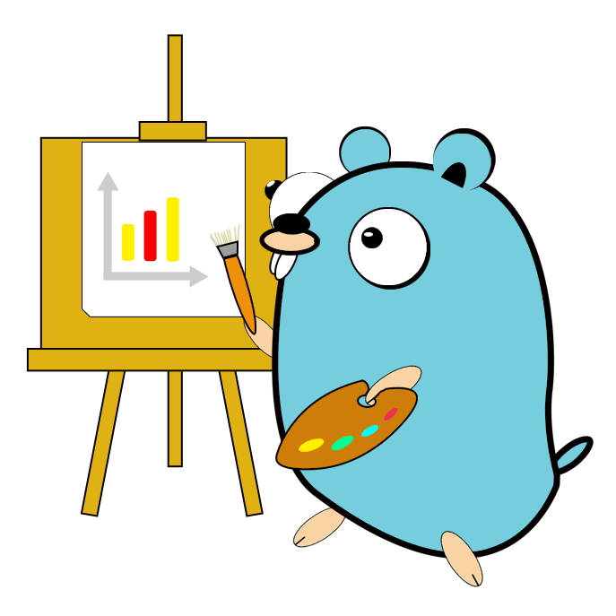
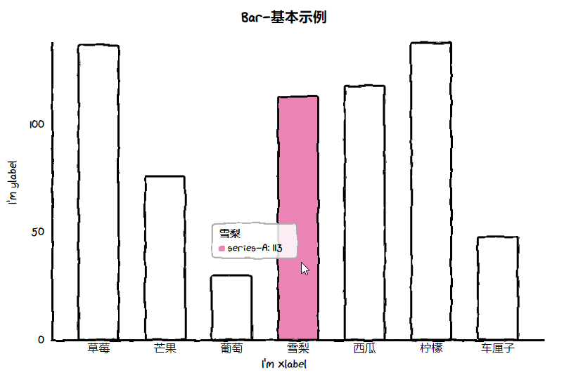
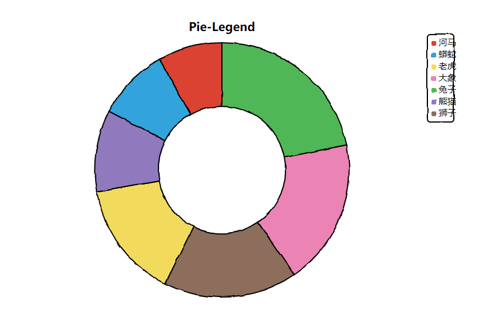
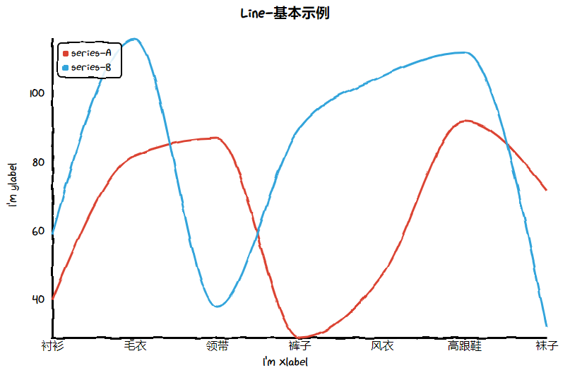
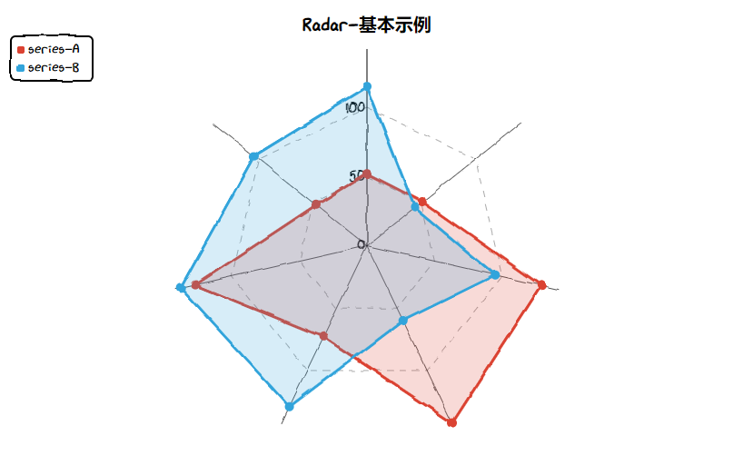
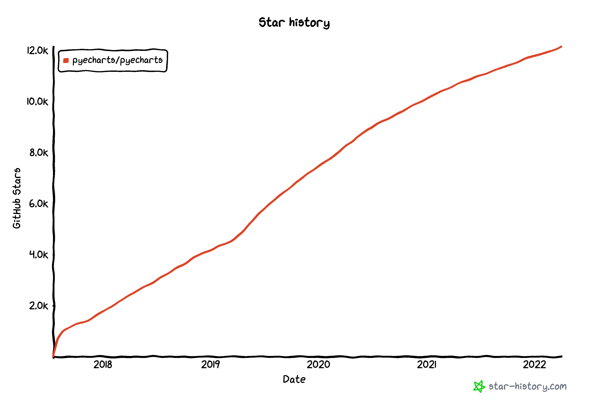

# 我的开源报告

多年以后，面对着近百个 Github Repos，我回想起那个第一次敲下 `git push origin master` 的下午。那时我的 Github 账号还是一片荒芜之地，没有 Star 没有 Fork 没有 Follower。世界新生伊始，许多概念仍不清楚，提到的时候尚需要翻翻 Google。

## 短短这五年

> 种一棵树最好的时间是五年前，其次是现在。

`2017-03-17`，这是我 Github 之旅的第一天，那年我大二。

<details>
<summary>点击查看完整 SQL</summary>

```sql
# 查询第一次提交时间
SELECT
    author_name,
    author_email,
    timestamp_rfc3339(min_ts) AS first_commit,
    duration(min_ts) as duration
FROM
    (
        SELECT
            author_name,
            author_email,
            min(timestamp(datetime)) AS min_ts
        FROM
            'db.commit'
        WHERE
            author_name = 'chenjiandongx'
        GROUP BY
            author_name,
            author_email
        ORDER BY
            min_ts
        LIMIT
            1
    ) AS a;
```
</details>

```shell
+---------------+----------------------+---------------------------+--------------------------+
| author_name   | author_email         | first_commit              | duration                 |
+---------------+----------------------+---------------------------+--------------------------+
| chenjiandongx | chenjiandongx@qq.com | 2017-03-17T16:36:58+00:00 | 5years 17days 7h 53m 36s |
+---------------+----------------------+---------------------------+--------------------------+
Query OK, elapsed: 15.903781ms
```

先看看这五年来创建的开源项目的数量，2018 年是高峰，之后就开始俯冲了。~借口~ 原因有几个，

1. 毕业以后时间没有那么地充裕。
2. 越到后面项目质量相对好一些，需要更多的时间打磨。
3. 想法变少了。

<details>
<summary>点击查看完整 SQL</summary>

```sql
# 查询每年创建项目数量
SELECT
    year(timestamp_rfc3339(a.first_commit)) AS year,
    count(a.repo_name) AS count
FROM
    (
        SELECT
            repo_name,
            min(timestamp(datetime)) AS first_commit
        FROM
            'db.commit'
        WHERE
            author_name = 'chenjiandongx'
        GROUP BY
            repo_name
    ) AS a
GROUP BY
    year
ORDER BY
    year;
```
</details>

<iframe width="680px" height="480px" style="border:none;" src="static/project-created-per-year.html"></iframe>

每年的提交数量，2018 年虽然项目创建得多，但提交数却没有上去，也就意味着项目的 ~质量不高~ 平均提交数变少了。

<details>
<summary>点击查看完整 SQL</summary>

```sql
# 查询每年提交数量
SELECT
    year(datetime) AS year,
    count(1) AS count
FROM
    'db.commit'
WHERE
    author_name = 'chenjiandongx'
    AND year(datetime) <= 2021
GROUP BY
    year
ORDER BY
    year;
```
</details>

<iframe width="680px" height="480px" style="border:none;" src="static/commit-total-per-year.html"></iframe>

算一下每年每天平均提交数，2017-2019 年期间大于 1 个提交（满腔热血）。到 2021 年每天已经低于 0.5 个提交了。

<details>
<summary>点击查看完整 SQL</summary>

```sql
# 查询每年每天平均提交数量
SELECT
    year(datetime) AS year,
    count(1) / 365.0 AS count
FROM
    'db.commit'
WHERE
    author_name = 'chenjiandongx'
    AND year(datetime) <= 2021
GROUP BY
    year
ORDER BY
    year;
```
</details>

<iframe width="680px" height="480px" style="border:none;" src="static/commit-count-per-year.html"></iframe>

视察下提交天数，2017 年和 2019 年基本相同，每年有接近一半的日子有 commit 记录。而 2020 年只有 3 个月，到 2021 就只有两个月了。

<details>
<summary>点击查看完整 SQL</summary>

```sql
# 查询每年提交天数
SELECT
    year,
    count(DISTINCT(dateday)) AS count
FROM
    (
        SELECT
            year(datetime) AS year,
            dateday(datetime) AS dateday
        FROM
            'db.commit'
        WHERE
            author_name = 'chenjiandongx'
            AND year(datetime) <= 2021
    ) AS a
GROUP BY
    year
ORDER BY
    year;
```
</details>

<iframe width="680px" height="480px" style="border:none;" src="static/commit-day-per-year.html"></iframe>

Tag 标识着项目版本的迭代，虽然不是每个项目都有 tag，但这也 ~不一定~ 可以反映出项目的演进过程。

<details>
<summary>点击查看完整 SQL</summary>

```sql
# 查询每年 tag 构建数量
SELECT
    year(datetime) AS year,
    count(1) AS count
FROM
    'db.tag'
WHERE
    year(datetime) <= 2021
GROUP BYtag-per-year
    year
ORDER BY
    year;
```
</details>

<iframe width="680px" height="480px" style="border:none;" src="static/tag-per-year.html"></iframe>

毫无疑问，tag 数量最多的项目还是 pyecharts。

<details>
<summary>点击查看完整 SQL</summary>

```sql
# 查询 tag 数量最多的项目
SELECT
    repo_name,
    count(1) AS count
FROM
    'db.tag'
GROUP BY
    repo_name
ORDER BY
    count DESC
LIMIT
    1;
```
</details>

```shell
+---------------------+-------+
| repo_name           | count |
+---------------------+-------+
| pyecharts/pyecharts | 43    |
+---------------------+-------+
Query OK, elapsed: 4.616617ms
```

看一下第一次创建 tag 是什么时候，还是 2017 年。

<details>
<summary>点击查看完整 SQL</summary>

```sql
# 查询第一次创建 tag 时间
SELECT
    timestamp_rfc3339(min(timestamp(datetime))) AS first_tag
FROM
    'db.tag';
```
</details>

```shell
+---------------------------+
| first_tag                 |
+---------------------------+
| 2017-08-16T23:31:08+00:00 |
+---------------------------+
Query OK, elapsed: 3.592829ms
```

## 2017: 你好世界

在创建了第一个 Repo 之后，2017 年后续也创建了多个 Repo，其中包括我开发周期最长的项目 [pyecharts/pyecharts](https://github.com/pyecharts/pyecharts)，那是我的 **第 11 个项目**。一开始的项目基本都是使用 Python 写的，众所周知 Python 是世界上最好的语言（口误，是 PHP）。有个项目除外，[chenjiandongx/Qt](https://github.com/chenjiandongx/Qt) 使用 C++ 写的，写了个 **记事本** 和一个 **贪吃蛇** 小游戏。

<details>
<summary>点击查看完整 SQL</summary>

```sql
# 查询 2017 年创建的项目
SELECT
    repo_name,
    created
FROM
    (
        SELECT
            repo_name,
            min(timestamp(datetime)) AS ts,
            timestamp_rfc3339(min(timestamp(datetime))) AS created
        FROM
            'db.commit'
        WHERE
            author_name = 'chenjiandongx'
            AND year(datetime) = 2017
        GROUP BY
            repo_name
        ORDER BY
            ts
    ) AS a;
```
</details>

```shell
+------------------------------------+---------------------------+
| repo_name                          | created                   |
+------------------------------------+---------------------------+
| chenjiandongx/mmjpg                | 2017-03-17T16:36:58+00:00 |
| chenjiandongx/stackoverflow-spider | 2017-03-26T14:31:11+00:00 |
| chenjiandongx/soksaccounts         | 2017-04-10T07:29:28+00:00 |
| chenjiandongx/mzitu                | 2017-04-17T12:58:35+00:00 |
| chenjiandongx/Github-spider        | 2017-04-23T12:20:23+00:00 |
| chenjiandongx/HupuLive             | 2017-05-07T04:12:26+00:00 |
| chenjiandongx/Qt                   | 2017-05-18T07:14:00+00:00 |
| chenjiandongx/51job-spider         | 2017-05-19T13:51:06+00:00 |
| chenjiandongx/cup-size             | 2017-06-02T08:59:17+00:00 |
| chenjiandongx/pyocr                | 2017-06-03T05:49:47+00:00 |
| pyecharts/pyecharts                | 2017-06-11T07:15:37+00:00 |
| chenjiandongx/wallpaper            | 2017-06-18T15:15:30+00:00 |
| chenjiandongx/bili-spider          | 2017-07-05T14:03:46+00:00 |
| chenjiandongx/pixiv                | 2017-07-05T14:04:41+00:00 |
| pyecharts/pyecharts-snapshot       | 2017-08-19T04:31:13+00:00 |
| chenjiandongx/fy                   | 2017-08-27T09:04:01+00:00 |
| pyecharts/jupyter-echarts          | 2017-08-31T09:00:53+00:00 |
| chenjiandongx/zhihu-zhuanlan       | 2017-09-03T13:25:59+00:00 |
| chenjiandongx/jianweibo            | 2017-09-21T14:04:28+00:00 |
| pyecharts/pyecharts-app            | 2017-09-27T15:57:02+00:00 |
| chenjiandongx/mim-system           | 2017-10-27T16:28:52+00:00 |
| chenjiandongx/torrent-cli          | 2017-11-15T15:55:55+00:00 |
| chenjiandongx/pytreemap            | 2017-11-27T15:46:53+00:00 |
+------------------------------------+---------------------------+
Query OK, elapsed: 12.306577ms
```

2017 年的项目大多是以爬虫为主，毕竟 Python 入门，上来二话不说就是 `requests.get`。看一下 2017 年的代码 insertion 和 deletion 的行数。`py` 行数那么多应该是包含一些测试用例的数据，不然 6w+ 有点离谱了。

<details>
<summary>点击查看完整 SQL</summary>

```sql
# 查询 2017 年提交语言分布
SELECT
    ext,
    sum(insertion) AS insertion,
    sum(deletion) AS deletion
FROM
    'db.change'
WHERE
    author_name = 'chenjiandongx'
    AND year(datetime) = 2017
    AND ext != ''
GROUP BY
    ext
ORDER BY
    deletion DESC
LIMIT
    8;
```
</details>

```shell
+------+-----------+----------+
| ext  | insertion | deletion |
+------+-----------+----------+
| py   | 68488     | 11668    |
| md   | 16863     | 7909     |
| csv  | 216063    | 6726     |
| html | 7609      | 6537     |
| js   | 4302      | 2976     |
| json | 43073     | 1473     |
| ini  | 135       | 45       |
| css  | 1566      | 33       |
+------+-----------+----------+
Query OK, elapsed: 15.128818ms
```

在校期间就无 **工作日** 和 **周末** 可言，毕竟不去上课的理由那么多。比如

* 起床发现时间没有整点，要不再睡会吧。
* 下床的时候左脚先落的地，要不看会 NBA 吧。
* 手机电量只有 95% 了，在宿舍充会电吧。
* ...

晚上 8 点到凌晨 1 点是写代码高峰期，应该是晚上灵感更好一点。最晚是凌晨 2 点。还行 ~没熬夜~。

<details>
<summary>点击查看完整 SQL</summary>

```sql
# 查询 2017 年每天小时提交分布
SELECT
    HOUR(datetime) AS HOUR,
    count(1) AS count
FROM
    'db.commit'
WHERE
    author_name = 'chenjiandongx'
    AND year(datetime) = 2017
GROUP BY
    HOUR
ORDER BY
    HOUR;
```
</details>

<iframe width="680px" height="480px" style="border:none;" src="static/commit-per-hour-2017.html"></iframe>

看 2017 年最长有连续多少天有提交记录。嗯，17 天。

<details>
<summary>点击查看完整 SQL</summary>

```sql
# 查询 2017 年连续提交天数
SELECT
    active_longest_start(datetime) as active_longest_start,
    active_longest_end(datetime) as active_longest_end,
    active_longest_days(datetime) as active_longest_days
FROM
    'db.commit'
WHERE
    author_name = 'chenjiandongx'
    AND year(datetime) = 2017;
```
</details>

```shell
+----------------------+--------------------+---------------------+
| active_longest_start | active_longest_end | active_longest_days |
+----------------------+--------------------+---------------------+
| 2017-07-17           | 2017-08-02         | 17                  |
+----------------------+--------------------+---------------------+
Query OK, elapsed: 12.035172ms
```

盲猜应该是在写 pyecharts，验证一下，没毛病。

<details>
<summary>点击查看完整 SQL</summary>

```sql
# 查询 2017 年连续提交天数最多的项目
SELECT
    repo_name,
    active_longest_days(datetime) AS active_longest_days
FROM
    'db.commit'
WHERE
    author_name = 'chenjiandongx'
    AND year(datetime) = 2017
GROUP BY
    repo_name
ORDER BY
    active_longest_days DESC
LIMIT
    1;
```
</details>

```shell
+---------------------+---------------------+
| repo_name           | active_longest_days |
+---------------------+---------------------+
| pyecharts/pyecharts | 17                  |
+---------------------+---------------------+
Query OK, elapsed: 11.527755ms
```

聊聊 Python 这门语言。

**Python 的优势**

**1）富有表达力**

python 的语法糖能和实用的函数让我们以简洁的代码完成功能，比如一行代码实现树结构，[One-line Tree in Python](https://gist.github.com/hrldcpr/2012250)。

**2）数据分析**

Python 作为一门胶水语言，在处理数据这块有着天然的优势，而且有着像 [numpy](https://github.com/numpy/numpy), [pandas](https://github.com/pandas-dev/pandas/), [jupyter](https://github.com/jupyter/) 这样成熟的工具，应该是数据分析的首选语言（或者是 R 语言？）。

而且还有像 [Matplotlib](https://matplotlib.org/) 和 [seaborn](https://seaborn.pydata.org/) 这样优秀的可视化库用于可视化分析，绝对算得上是科研利器。

**3）机器学习**

Python 近几年因为机器学习热潮又火了一波。[TensorFlow](https://github.com/tensorflow/tensorflow) 是 2015 年 11 月开源的，[PyTorch](https://github.com/pytorch/pytorch) 是 2016 年 10 月开源的。

**4）完善的生态**

Python 诞生至今已有 30 年的历史了，也成为了几乎所有 Linux 发行版默认安装的语言。Python 的社区是相当完善的，拥有者数量众多的使用者和公司，这些开发者为其贡献了海量的第三方库。pypi 仓库数据：

* 367,738 projects
* 3,358,062 releases
* 5,850,001 files
* 583,496 users

**Python 的劣势**

**1）糟糕的性能**

在这个多核 CPU 的时代，GIL 这把大锁就显得非常捉襟见肘了。且运行时编译这种特性也决定了其执行开销会远大于静态编译语言。

**2）可执行文件**

Python 运行需要一个虚拟机，所以很难将其代码编译成可执行二进制文件进行分发，一个 helloworld 打出了几十上百 M。虽然说 Python 是 Linux 标配，但这世界上还存在着一种被广泛使用而没有默认安装 Python 的操作系统，嗯，Windows。

**3）黑魔法太多**

Python 及其灵活的元类模式导致这个特性容易被滥用，很多开源代码的写法实在是太花里胡哨，非常不易阅读。另外就是像 `**kwargs` 这种参数传递方式，不到具体执行的那一行代码压根不知道是啥逻辑（叹气）。

**4）版本环境**

在安装一些 Python 写的工具的时候，由于工具是全局安装，所以就会出现依赖版本互斥的情况。另外 Python 其实两门语言，一门叫 Python2，另一门叫 Python3（大雾）。

**总结：Python 仍旧是编程世界里最好用的瑞士军刀（powerful）。**

## 2018: 渐入佳境

2018 年开始得到了一些关注，因为 pyecharts 项目开始有了一些热度，也开始享受合作开发的乐趣。在开发最热火朝天的那段日子，几乎每天都会收到 issue。有提问题的，有吐槽的，但 PR 却寥寥无几。但在开发 pyecharts 的时候，也陆陆续续开了很多新坑。也是从这时候开始接触了 Golang，那是另一段故事的开端。

2018 年一共创建了 27 个开源项目。

<details>
<summary>点击查看完整 SQL</summary>

```sql
# 查询 2018 年提交的项目
SELECT
    repo_name,
    timestamp_rfc3339(a.first_commit) as created
FROM
    (
        SELECT
            repo_name,
            min(timestamp(datetime)) AS first_commit
        FROM
            'db.commit'
        WHERE
            author_name = 'chenjiandongx'
        GROUP BY
            repo_name
    ) AS a
WHERE
    year(timestamp_rfc3339(a.first_commit)) = 2018
ORDER BY
    a.first_commit;
```
</details>

```shell
+------------------------------------------+---------------------------+
| repo_name                                | created                   |
+------------------------------------------+---------------------------+
| pyecharts/pyecharts-users-cases          | 2018-01-06T09:54:39+00:00 |
| chenjiandongx/bili-video-rank            | 2018-03-06T14:58:20+00:00 |
| chenjiandongx/yummy-girls                | 2018-03-25T01:33:37+00:00 |
| chenjiandongx/async-bili-spider          | 2018-03-26T15:53:11+00:00 |
| chenjiandongx/pyhtime                    | 2018-04-01T15:31:54+00:00 |
| chenjiandongx/lolly                      | 2018-04-03T14:30:14+00:00 |
| chenjiandongx/docs-need-space            | 2018-04-09T15:38:27+00:00 |
| chenjiandongx/gh-contributors            | 2018-04-14T03:11:30+00:00 |
| chenjiandongx/pymysql-connection-pool    | 2018-04-22T15:33:12+00:00 |
| chenjiandongx/Microsoft-appearance-score | 2018-05-09T12:51:28+00:00 |
| chenjiandongx/async-proxy-pool           | 2018-05-10T14:46:36+00:00 |
| chenjiandongx/photo-gevent               | 2018-06-11T08:11:32+00:00 |
| chenjiandongx/youdao-go                  | 2018-06-13T09:28:49+00:00 |
| chenjiandongx/photo-go                   | 2018-06-13T15:08:51+00:00 |
| chenjiandongx/photo-asyncio              | 2018-06-13T16:51:52+00:00 |
| chenjiandongx/magnet-dht                 | 2018-06-22T03:10:43+00:00 |
| chenjiandongx/photo-trio                 | 2018-07-30T13:09:13+00:00 |
| chenjiandongx/awesome-asyncio-cn         | 2018-07-31T04:00:33+00:00 |
| chenjiandongx/slipper                    | 2018-08-04T13:05:49+00:00 |
| pyecharts/geo-region-coords              | 2018-08-22T15:36:37+00:00 |
| chenjiandongx/make-it-colorful           | 2018-08-26T11:36:50+00:00 |
| chenjiandongx/weekly-email-subscribe     | 2018-10-20T15:09:55+00:00 |
| chenjiandongx/hupu-referee-report        | 2018-11-18T09:11:08+00:00 |
| chenjiandongx/skrskr                     | 2018-12-02T08:17:11+00:00 |
| go-echarts/go-echarts                    | 2018-12-04T15:43:40+00:00 |
| go-echarts/go-echarts-assets             | 2018-12-23T10:07:01+00:00 |
| chenjiandongx/emoji.py                   | 2018-12-29T15:54:24+00:00 |
+------------------------------------------+---------------------------+
Query OK, elapsed: 10.990047ms
```

有三个项目是用 Golang 编写的。其中包括了另外一个可视化项目 [go-echarts](https://github.com/go-echarts/go-echarts)，这也算是我第一个完整的 Golang 项目，是为重构 pyecharts 做准备而尝试开发的，还专门为其设计了一个 logo。

<div></div>

go-echarts 曾登版 Github Trending，这个项目也重构过一次，具体详见 [go-echarts/issues/74](https://github.com/go-echarts/go-echarts/issues/74)，当时也是花费了我两个月的时间，不过最后立的 flag 没有倒，还是完成了。go-echarts 的代码就多一点了，有 6000 行。

<details>
<summary>点击查看完整 SQL</summary>

```sql
# 查询 go-echarts 项目代码行数
SELECT
    repo_name, ext, code, comments, blanks
FROM
    'db.snapshot'
WHERE
    repo_name = 'go-echarts/go-echarts';
```
</details>

```shell
+-----------------------+----------+------+----------+--------+
| repo_name             | ext      | code | comments | blanks |
+-----------------------+----------+------+----------+--------+
| go-echarts/go-echarts | go       | 6827 | 1528     | 874    |
| go-echarts/go-echarts | markdown | 0    | 308      | 86     |
| go-echarts/go-echarts | shell    | 36   | 1        | 9      |
+-----------------------+----------+------+----------+--------+
Query OK, elapsed: 4.864459ms
```

看一下 2018 年项目的语言分布情况，Python yyds!

<details>
<summary>点击查看完整 SQL</summary>

```sql
# 查询 2018 年项目语言分布
SELECT
    ext,
    count(ext) AS count
FROM
    (
        SELECT
            repo_name,
            ext,
            sum(insertion) AS insertion
        FROM
            'db.change'
        WHERE
            author_name = 'chenjiandongx'
            AND year(datetime) = 2018
            AND ext IN ('py', 'js', 'go', 'html', 'css')
        GROUP BY
            repo_name,
            ext
        ORDER BY
            repo_name,
            insertion DESC
    ) AS a
GROUP BY
    ext
ORDER BY
    count DESC;
```
</details>

<iframe width="680px" height="480px" style="border:none;" src="static/change-language-2018.html"></iframe>

我们来把一天的时间划分为四个时间段，分别是午夜，早上，中午和晚上。

| hour   | [0, 8)   | [8, 12) | [12, 18)  | [18, 24) |
| ------ | -------- | ------- | --------- | -------- |
| period | Midnight | Morning | Afternoon | Evening  |

再来看一下在这四个时间段的提交比例，可以看到晚上占比第一，午夜也有近 10% 的比例。

<details>
<summary>点击查看完整 SQL</summary>

```sql
# 查询 2018 年每天时段提交分布
SELECT
    period(datetime) as period,
    count(1) as count
FROM
    'db.commit'
WHERE
    author_name = 'chenjiandongx'
    AND year(datetime) = 2018
GROUP BY
    period;
```
</details>

<iframe width="680px" height="480px" style="border:none;" src="static/commit-period-2018.html"></iframe>

## 2019: 打工人

2019 年，我毕业啦，身份从学生转变为真正的打工人，曾经梦想仗剑走天涯，后来因为工作太忙没去成。再也没能像大学时期那么潇洒了

* 起床看到睡晚了，卧槽，赶紧的，不要迟到了。
* 起床看到下雨了，卧槽，赶紧的，不要迟到了。
* ...

这一年共创建 16 个项目。

<details>
<summary>点击查看完整 SQL</summary>

```sql
# 查询 2019 年提交的项目
SELECT
    repo_name,
    timestamp_rfc3339(a.first_commit) as created
FROM
    (
        SELECT
            repo_name,
            min(timestamp(datetime)) AS first_commit
        FROM
            'db.commit'
        WHERE
            author_name = 'chenjiandongx'
        GROUP BY
            repo_name
    ) AS a
WHERE
    year(timestamp_rfc3339(a.first_commit)) = 2019
ORDER BY
    a.first_commit;
```
</details>

```shell
+-------------------------------+---------------------------+
| repo_name                     | created                   |
+-------------------------------+---------------------------+
| chenjiandongx/collections     | 2019-01-09T06:34:50+00:00 |
| chenjiandongx/wetalk          | 2019-01-17T06:33:49+00:00 |
| pyecharts/pyecharts-assets    | 2019-03-27T14:52:14+00:00 |
| pyecharts/05x-docs            | 2019-03-29T07:45:07+00:00 |
| pyecharts/website             | 2019-03-30T00:53:33+00:00 |
| pyecharts/snapshot-selenium   | 2019-04-10T17:55:07+00:00 |
| pyecharts/snapshot-phantomjs  | 2019-04-10T18:13:39+00:00 |
| chenjiandongx/kfk             | 2019-06-17T06:34:58+00:00 |
| pyecharts/geopython-2019-talk | 2019-06-29T04:53:02+00:00 |
| chenjiandongx/how             | 2019-07-27T14:08:24+00:00 |
| chenjiandongx/ginprom         | 2019-08-15T06:50:04+00:00 |
| cutecharts/cutecharts.py      | 2019-10-08T14:20:14+00:00 |
| pyecharts/snapshot-pyppeteer  | 2019-10-15T01:19:09+00:00 |
| chenjiandongx/conveyor        | 2019-12-10T07:43:29+00:00 |
| chenjiandongx/kslb            | 2019-12-23T02:56:29+00:00 |
| chenjiandongx/pls             | 2019-12-28T07:30:59+00:00 |
+-------------------------------+---------------------------+
Query OK, elapsed: 11.258102ms
```

Golang 项目的比例开始逐步增大了，已经有 9 个项目开始用 Golang 编写了，但第一仍旧是 Python。2019 年开始接触到 Kubernetes 这个云原生的概念，自己也开始动手捣鼓个小集群。也是在这一年，我买了人生第一台 Macbook Pro（没有实体 Esc，绝版）。

<details>
<summary>点击查看完整 SQL</summary>

```sql
# 查询 2019 年项目语言分布
SELECT
    ext,
    count(ext) AS count
FROM
    (
        SELECT
            repo_name,
            ext,
            sum(insertion) AS insertion
        FROM
            'db.change'
        WHERE
            author_name = 'chenjiandongx'
            AND year(datetime) = 2019
            AND ext IN ('py', 'js', 'go', 'html', 'css')
        GROUP BY
            repo_name,
            ext
        ORDER BY
            repo_name,
            insertion DESC
    ) AS a
GROUP BY
    ext
ORDER BY
    count DESC;
```
</details>

<iframe width="680px" height="480px" style="border:none;" src="static/change-language-2019.html"></iframe>

2019 年的提交相比于 2018 年，下午提交的比例有所增加，但整体来看，白天和晚上还是各占一半。

<iframe width="680px" height="480px" style="border:none;" src="static/commit-period-2019.html"></iframe>

2019 年还有另外一个可视化项目 [cutecharts](https://github.com/cutecharts/cutecharts)，一个手绘风格的图标库，还是挺可爱的，示例如下。

<div>
    
    
    
    
</div>

cutecharts 是一个非常小巧的项目，代码不过千行。

<details>
<summary>点击查看完整 SQL</summary>

```sql
# 查询 cutecharts 项目代码
SELECT
    repo_name, ext, code, comments, blanks
FROM
    'db.snapshot'
WHERE
    repo_name = 'cutecharts/cutecharts.py';
```
</details>

```shell
+--------------------------+------------+------+----------+--------+
| repo_name                | ext        | code | comments | blanks |
+--------------------------+------------+------+----------+--------+
| cutecharts/cutecharts.py | autoconf   | 2    | 0        | 0      |
| cutecharts/cutecharts.py | batch      | 2    | 0        | 0      |
| cutecharts/cutecharts.py | html       | 44   | 0        | 8      |
| cutecharts/cutecharts.py | markdown   | 0    | 329      | 162    |
| cutecharts/cutecharts.py | python     | 927  | 6        | 237    |
| cutecharts/cutecharts.py | shell      | 2    | 0        | 0      |
| cutecharts/cutecharts.py | plain text | 0    | 8        | 0      |
| cutecharts/cutecharts.py | yaml       | 13   | 0        | 3      |
+--------------------------+------------+------+----------+--------+
```

比如可以用它来绘制 star history。



2019 年还有一个大的开发工作是重构 pyecharts，重构目标，[pyecharts/issues/892](https://github.com/pyecharts/pyecharts/issues/892)，在进行了深刻地反思之后，决定还是要撸起袖子开干。这是当时立下的 flag（2019-01-15）。

> 鉴于现在本人的手头上的事情比较多，本次重构本身又需要大量的时间，所以会慢慢推进的，进度肯定快不了，不过它终将会到来！

然后在 2019-04-28 的时候，重构完成，发布了 v1.0 版本，[pyecharts/issues/1033](https://github.com/pyecharts/pyecharts/issues/1033)。可以来看看这中间三个月的提交记录，共计 118 个 commit。

<details>
<summary>点击查看完整 SQL</summary>

```sql
# 查询 2019 年 1-4 月 pyecharts 提交总数
SELECT
    count(1) as count
FROM
    'db.commit'
WHERE
    author_name = 'chenjiandongx'
    AND repo_name = 'pyecharts/pyecharts'
    AND year(datetime) = 2019
    AND MONTH(datetime) IN (1, 2, 3, 4);
```
</details>

```shell
+-------+
| count |
+-------+
| 118   |
+-------+
Query OK, elapsed: 10.601985ms
```

不熬夜怎么写代码（薅了薅头发，又掉了几根）。

<details>
<summary>点击查看完整 SQL</summary>

```sql
# 查询 2019 年 1-4 月 pyecharts 按小时提交记录
SELECT
    HOUR(datetime) AS HOUR,
    count(1) as count
FROM
    'db.commit'
WHERE
    author_name = 'chenjiandongx'
    AND repo_name = 'pyecharts/pyecharts'
    AND year(datetime) = 2019
    AND MONTH(datetime) IN (1, 2, 3, 4)
GROUP BY
    HOUR
ORDER BY
    HOUR;
```
</details>

<iframe width="680px" height="480px" style="border:none;" src="static/commit-pyecharts-2019.html"></iframe>

按提交行数查看，工作量还是蛮大的。

<details>
<summary>点击查看完整 SQL</summary>

```sql
# 查询 pyecharts 重构记录
SELECT
    ext,
    sum(insertion) as insertion,
    sum(deletion) as deletion
FROM
    'db.change'
WHERE
    author_name = 'chenjiandongx'
    AND repo_name = 'pyecharts/pyecharts'
    AND ext != ''
    AND year(datetime) = 2019
    AND MONTH(datetime) IN (1, 2, 3, 4)
GROUP BY
    ext
ORDER BY
    insertion DESC;
```
</details>

```shell
+------+-----------+----------+
| ext  | insertion | deletion |
+------+-----------+----------+
| py   | 18468     | 24051    |
| json | 16240     | 19087    |
| html | 2270      | 2298     |
| md   | 1564      | 18860    |
| yml  | 24        | 31       |
| bat  | 13        | 15       |
| in   | 5         | 6        |
| txt  | 4         | 19       |
| sh   | 2         | 4        |
| cfg  | 2         | 5        |
| uml  | 0         | 121      |
| png  | 0         | 0        |
| ico  | 0         | 0        |
+------+-----------+----------+
Query OK, elapsed: 16.529302ms
```

同年 11 月，pyecharts 宣布交由另外一个核心开发者维护。[来自 pyecharts 作者的一封通知函](https://github.com/pyecharts/pyecharts/issues/1402)。

## 2020: 新航道

2020 年开始，岗位方向转变为监控系统开发岗，算是入了监控的坑了。在这之前对监控系统实际没有一个很立体的概念，对 promethues 也是只有很粗浅的认识。这一年的主要开发任务是底层采集器和传输链路的改造工作，所以 2020 年的开源项目也开始跟监控搭边。

另外 2020 年也参与了另外一个开源的监控项目 [didi/nightingale](https://github.com/didi/nightingale)，贡献了一些 PR 并成为了其 committer，不过遗憾的是后续就没有再深度参与进去了，毕竟公司内部没有使用其产品或者组件。**没有生产验证和踩坑也很难贡献高质量的 PR。**

在这 2020 年创建的 14 个项目里面，`pinger` 和 `tszlist` 最终被用于公司的 **生产环境** 上。前者是一个 PING 工具库，后者是一种时序数据线程安全链表。

<details>
<summary>点击查看完整 SQL</summary>

```sql
# 查询 2020 年提交的项目
SELECT
    repo_name,
    timestamp_rfc3339(a.first_commit) as created
FROM
    (
        SELECT
            repo_name,
            min(timestamp(datetime)) AS first_commit
        FROM
            'db.commit'
        WHERE
            author_name = 'chenjiandongx'
        GROUP BY
            repo_name
    ) AS a
WHERE
    year(timestamp_rfc3339(a.first_commit)) = 2020
ORDER BY
    a.first_commit;
```
</details>

```shell
+-----------------------------------+---------------------------+
| repo_name                         | created                   |
+-----------------------------------+---------------------------+
| pyecharts/pyecharts-gallery       | 2020-01-10T01:16:55+00:00 |
| chenjiandongx/dockerstats         | 2020-01-21T03:45:01+00:00 |
| chenjiandongx/prometheus101       | 2020-02-05T15:35:46+00:00 |
| chenjiandongx/kubectl-images      | 2020-02-13T14:13:37+00:00 |
| cutecharts/cutecharts.java        | 2020-04-03T12:51:01+00:00 |
| pyecharts/vendor                  | 2020-04-14T11:21:23+00:00 |
| pyecharts/articles                | 2020-04-26T02:18:34+00:00 |
| chenjiandongx/pinger              | 2020-04-30T07:20:15+00:00 |
| chenjiandongx/aura                | 2020-05-20T12:19:04+00:00 |
| chenjiandongx/memcached-collector | 2020-05-29T18:43:56+00:00 |
| go-echarts/examples               | 2020-07-26T15:15:00+00:00 |
| chenjiandongx/oscar               | 2020-08-05T18:02:37+00:00 |
| chenjiandongx/tszlist             | 2020-10-18T16:14:31+00:00 |
| go-echarts/statsview              | 2020-11-15T18:32:12+00:00 |
+-----------------------------------+---------------------------+
Query OK, elapsed: 11.507094ms
```

2020 年开始，全面步入 Golang 时代了，项目都是偏好于 Golang。

<details>
<summary>点击查看完整 SQL</summary>

```sql
# 查询 2020 年项目语言分布
SELECT
    ext,
    count(ext) AS count
FROM
(
        SELECT
            repo_name,
            ext,
            sum(insertion) AS insertion
        FROM
            'db.change'
        WHERE
            author_name = 'chenjiandongx'
            AND year(datetime) = 2020
            AND ext IN ('py', 'js', 'go', 'html', 'css')
        GROUP BY
            repo_name,
            ext
        ORDER BY
            repo_name,
            insertion DESC
    ) AS a
GROUP BY
    ext
ORDER BY
    count DESC;
```
</details>

<iframe width="680px" height="480px" style="border:none;" src="static/change-language-2020.html"></iframe>

从代码提交行数也可以看出来，Golang 那是占了绝对的大头，不过 insertion 这么多是因为包含了项目的 `vendor`。没错，Python 只有 100 多行（喜新厌旧属于是）。

<details>
<summary>点击查看完整 SQL</summary>

```sql
# 查询 2020 年提交语言分布
SELECT
    ext,
    sum(insertion) AS insertion,
    sum(deletion) AS deletion
FROM
    'db.change'
WHERE
    author_name = 'chenjiandongx'
    AND year(datetime) = 2020
    AND ext != ''
GROUP BY
    ext
ORDER BY
    deletion DESC
LIMIT
    10;
```
</details>

```shell
+------+-----------+----------+
| ext  | insertion | deletion |
+------+-----------+----------+
| go   | 897955    | 33256    |
| json | 33751     | 33129    |
| md   | 20466     | 10632    |
| yml  | 1114      | 496      |
| js   | 13042     | 341      |
| sum  | 1276      | 229      |
| html | 1598      | 152      |
| uml  | 0         | 121      |
| py   | 188       | 63       |
| toml | 253       | 48       |
+------+-----------+----------+
Query OK, elapsed: 18.657274ms
```

其中 [chenjiandongx/kubectl-images](https://github.com/chenjiandongx/kubectl-images) 是一个 `kubectl` 的命令行插件，插件已归档到 [kubernetes-sigs/krew](https://github.com/kubernetes-sigs/krew)，并且 `krew` 的作者还给我这个项目发过 PR。插件可以通过 `kubectl krew install` 安装。

```shell
$ kubectl krew install images
Updated the local copy of plugin index.
Installing plugin: images
Installed plugin: images
\
 | Use this plugin:
 | 	kubectl images
 | Documentation:
 | 	https://github.com/chenjiandongx/kubectl-images
/
```

[chenjiandongx/pinger](https://github.com/chenjiandongx/pinger) 这个项目也收到过 [mattn](https://github.com/mattn) 的 PR，mattn 是 Golang 的团队成员之一。

按周查看提交记录，周一周二周三这三个工作日的提交反而更多。

<details>
<summary>点击查看完整 SQL</summary>

```sql
# 查询 2020 年按周提交数
SELECT
    weekday AS week,
    count
FROM
(
        SELECT
            weekday(datetime) AS weekday,
            weeknum(datetime) AS weeknum,
            count(1) AS count
        FROM
            'db.commit'
        WHERE
            author_name = 'chenjiandongx'
            AND year(datetime) = 2020
        GROUP BY
            weeknum,
            weekday
        ORDER BY
            weeknum
    ) AS a;
```
</details>

<iframe width="680px" height="480px" style="border:none;" src="static/commit-week-2020.html"></iframe>

那就按照提交的小时并按工作日和周末来区分提交数。

<details>
<summary>点击查看完整 SQL</summary>

```sql
# 查询 2020 年按周末和工作日小时提交数
SELECT
    HOUR,
    sum(count) AS count
FROM
    (
        SELECT
            HOUR(datetime) AS HOUR,
            0 AS count
        FROM
            'db.commit'
        UNION
        SELECT
            HOUR(datetime) AS HOUR,
            count(1) AS count
        FROM
            'db.commit'
        WHERE
            author_name = 'chenjiandongx'
            AND year(datetime) = 2020
            AND weeknum(datetime) NOT IN(5, 6)
        GROUP BY
            HOUR
        ORDER BY
            HOUR
    ) AS a
GROUP BY
    HOUR
ORDER BY
    HOUR;

---
SELECT
    HOUR,
    sum(count) AS count
FROM
    (
        SELECT
            HOUR(datetime) AS HOUR,
            0 AS count
        FROM
            'db.commit'
        UNION
        SELECT
            HOUR(datetime) AS HOUR,
            count(1) AS count
        FROM
            'db.commit'
        WHERE
            author_name = 'chenjiandongx'
            AND year(datetime) = 2020
            AND weeknum(datetime) IN(5, 6)
        GROUP BY
            HOUR
        ORDER BY
            HOUR
    ) AS a
GROUP BY
    HOUR
ORDER BY
    HOUR;
```
</details>

<iframe width="680px" height="480px" style="border:none;" src="static/commit-week-period-2020.html"></iframe>

工作日的凌晨 12 点到 1 点还可以理解，2 点钟到 3 点钟居然也有接近 10 个提交，第二天不用上班的吗？也可能是那时候年轻，体力好（应该是的）。工作日的早上 9 点到下午 15 点是提交高峰期，这应该是在写公司用到的开源项目，如上面提到的 `pinger` 和 `tszlist`，并且 12 点到 14 点是中午休息时间。

接下来聊聊 Golang。

**Golang 的优势**

**1）简洁**

Golang 的语法和关键字给人一种惜字如金的感觉，非常地克制。但也是这种简洁，让学习曲线非常平滑，`gofmt` 也在代码格式化上一统天下，工具链用起来舒服。

**2）并发**

Golang 天然支持并发，`go` 关键字让开发者以近乎同步的代码异步地运行，`Goroutine` 和 `Channel` 在手，并发我有。且得益于高效的调度模型和 GC 系统，Golang 的 STW 的时间已经变得极短。在非极致的性能要求，如实时系统，IO 敏感的场景下，开发者并不需要关心如何进行调度调优。

**3）部署方便**

在没有 Cgo 代码依赖，Golang 可以非常轻松地进行交叉编译，这种特性无论对交付还是测试开发是很实用的。

**4）云原生**

新时代的操作系统 Kubernetes 就是 Golang 编写的，所以众多的云原生组件都偏好于使用 Golang。在云原生领域，Golang 已经是绝对的霸主地位。[CNCF Projects](https://www.cncf.io/projects/)。

**Golang 的劣势**

暂无发现特别明显的劣势，用作主力开发语言还是蛮舒服的。如果非要吐槽的话，可能有以下几点：

* 包管理：并不是所有开源项目都会遵守 `Go Module` 的原则。
* 未使用变量：测试代码的时候每次都得注释一大堆东西。
* JSON 未赋值变量：除了使用指针变量声明类型好像没有其他解决方案（比如怎么区分 0 是数据中的 0 还是该字段根本不存在）。
* 错误处理：200 百行代码可能有 30 行是在写 `if err != nil { return err }`，相比之下 rust 的 `?` 错误传播就很 nice。
* ...

## 2021: 厚积薄发

**厚不厚积不知道，但薄发是真的薄**，毕竟 2021 年总共才创建了 5 个项目（理不直气也壮）。

<details>
<summary>点击查看完整 SQL</summary>

```sql
# 查询 2021 年提交的项目
SELECT
    repo_name,
    timestamp_rfc3339(a.first_commit) as created
FROM
    (
        SELECT
            repo_name,
            min(timestamp(datetime)) AS first_commit
        FROM
            'db.commit'
        WHERE
            author_name = 'chenjiandongx'
        GROUP BY
            repo_name
    ) AS a
WHERE
    year(timestamp_rfc3339(a.first_commit)) = 2021
ORDER BY
    a.first_commit;
```
</details>

```shell
+-----------------------+---------------------------+
| repo_name             | created                   |
+-----------------------+---------------------------+
| chenjiandongx/yap     | 2021-01-18T16:01:03+00:00 |
| chenjiandongx/logger  | 2021-06-08T05:51:16+00:00 |
| chenjiandongx/mandodb | 2021-06-19T09:33:37+00:00 |
| chenjiandongx/sniffer | 2021-11-08T15:34:49+00:00 |
| chenjiandongx/clock   | 2021-11-24T16:50:41+00:00 |
+-----------------------+---------------------------+
Query OK, elapsed: 9.669772ms
```

* [mandodb](https://github.com/chenjiandongx/mandodb): 一个从零开始实现的时序数据库项目，算做是学习 TSDB 的一个笔记吧。
* [sniffer](https://github.com/chenjiandongx/sniffer): 一个网络流量嗅探工具，使用了 BPF 的特性，压测流量可达到 `2.5GiBps`。该项目也成功提交到了 [homebrew](https://brew.sh/) 官方仓库，可以通过 `brew install sniffer` 安装。

这两个项目花了今年大多数的业余开发时间，按月份看一下提交记录。6-8 月份主要是在开发 `mandodb`，11-12 月是在开发 `sniffer`，呼应上了。

<details>
<summary>点击查看完整 SQL</summary>

```sql
# 查询 2021 年月份提交数
SELECT
    MONTH(datetime) AS MONTH,
    count(1) AS count
FROM
    'db.commit'
WHERE
    author_name = 'chenjiandongx'
    AND year(datetime) = 2021
GROUP BY
    MONTH
ORDER BY
    MONTH;
```
</details>

<iframe width="680px" height="480px" style="border:none;" src="static/commit-month-2021.html"></iframe>

`mandodb` 和 `sniffer` 代码行数均在两千行左右。

<details>
<summary>点击查看完整 SQL</summary>

```sql
# 查询 mandodb、sniffer 代码行数
SELECT
    repo_name, ext, code, comments, blanks
FROM
    'db.snapshot'
WHERE
    repo_name = 'chenjiandongx/mandodb' or repo_name = 'chenjiandongx/sniffer';
```
</details>

```shell
+-----------------------+----------+------+----------+--------+
| repo_name             | ext      | code | comments | blanks |
+-----------------------+----------+------+----------+--------+
| chenjiandongx/sniffer | go       | 1874 | 85       | 348    |
| chenjiandongx/mandodb | go       | 2251 | 141      | 545    |
| chenjiandongx/sniffer | markdown | 0    | 61       | 41     |
| chenjiandongx/mandodb | markdown | 0    | 855      | 283    |
+-----------------------+----------+------+----------+--------+
Query OK, elapsed: 4.138411ms
```

按工作日和周末来区分不同时间的提交数量。可以看到绝大多数的提交都是在晚上 10 点钟以后，一般是那时候才忙完，可以开始写自己的代码。23 点到凌晨 1 点那确实提交了不少代码，特别是在工作日，时间是挤出来的（挤得越多头发掉得越快）。

<details>
<summary>点击查看完整 SQL</summary>

```sql
# 查询 2021 年按周末和工作日小时提交数
SELECT
    HOUR,
    sum(count) AS count
FROM
    (
        SELECT
            HOUR(datetime) AS HOUR,
            0 AS count
        FROM
            'db.commit'
        UNION
        SELECT
            HOUR(datetime) AS HOUR,
            count(1) AS count
        FROM
            'db.commit'
        WHERE
            author_name = 'chenjiandongx'
            AND year(datetime) = 2021
            AND weeknum(datetime) NOT IN(5, 6)
        GROUP BY
            HOUR
        ORDER BY
            HOUR
    ) AS a
GROUP BY
    HOUR
ORDER BY
    HOUR;

---
SELECT
    HOUR,
    sum(count) AS count
FROM
    (
        SELECT
            HOUR(datetime) AS HOUR,
            0 AS count
        FROM
            'db.commit'
        UNION
        SELECT
            HOUR(datetime) AS HOUR,
            count(1) AS count
        FROM
            'db.commit'
        WHERE
            author_name = 'chenjiandongx'
            AND year(datetime) = 2021
            AND weeknum(datetime) IN(5, 6)
        GROUP BY
            HOUR
        ORDER BY
            HOUR
    ) AS a
GROUP BY
    HOUR
ORDER BY
    HOUR;
```
</details>

<iframe width="680px" height="480px" style="border:none;" src="static/commit-week-period-2021.html"></iframe>

2021 年总体的项目数量和提交量都大幅度减少，但是还是有收获。mandodb 登上了 Github Trending，而 sniffer 则是顺利加入到 homebrew 中。这两个项目从构思到完成差不多都花了三个月，这期间也一直在学习，比如研究 [prometheus](https://github.com/prometheus) 源码启发灵感。读 [bandwhich](https://github.com/imsnif/bandwhich) 和 [nethogs](https://github.com/raboof/nethogs) 代码来弄明白如何进行网络流量嗅探。

在读 bandwhcih 源码的时候，也开始温习 rust，之前陆陆续续有看过 rust 相关的文档和书籍，但一直都没有完整地写过一个 rust 项目。正好写这份报告需要用到一个 git 记录指标采集工具，就干脆用 rust 实现了。

## 代码永不眠

经过了五年的开源，也收获了些许的认同，累计获得 27k+ 的 stars 和 6k+ 的 forks。

<details>
<summary>点击查看完整 SQL</summary>

```sql
# 查询 stars 和 forks 总数
SELECT
    sum(stars) AS stars,
    sum(forks) AS forks
FROM
    'db.active';
```
</details>

```shell
+-------+-------+
| stars | forks |
+-------+-------+
| 27354 | 6422  |
+-------+-------+
Query OK, elapsed: 2.951936ms
```

但这实际上不是我一个人的功劳，总共有 134 位开发者参与到我维护的开源项目中来。

<details>
<summary>点击查看完整 SQL</summary>

```sql
# 查询开源贡献者
SELECT
    count(DISTINCT(author_name)) AS contributors
FROM
    'db.commit'
WHERE
    author_name != 'chenjiandongx';
```
</details>

```shell
+--------------+
| contributors |
+--------------+
| 134          |
+--------------+
Query OK, elapsed: 12.12454ms
```

这 100 多位开发者的跨越了多个不同的时区（从提交时间来看）。

<details>
<summary>点击查看完整 SQL</summary>

```sql
# 查询贡献者时区
SELECT
    DISTINCT(timezone(datetime)) AS timezone
FROM
    'db.commit'
ORDER BY
    timezone;
```
</details>

```shell
+----------+
| timezone |
+----------+
| +00:00   |
| +01:00   |
| +02:00   |
| +03:00   |
| +05:00   |
| +07:00   |
| +08:00   |
| +09:00   |
| +10:00   |
| +11:00   |
| -03:00   |
| -04:00   |
| -05:00   |
| -06:00   |
| -07:00   |
| -08:00   |
+----------+
Query OK, elapsed: 8.929429ms
```

同样地，他们也来自不同的社区。

<details>
<summary>点击查看完整 SQL</summary>

```sql
# 查询贡献者社区
SELECT
    DISTINCT(author_domain) AS domain
FROM
    'db.commit'
ORDER BY
    domain;
```
</details>

```shell
+--------------------------+
| domain                   |
+--------------------------+
| 126.com                  |
| 163.com                  |
| all-my-life.cn           |
| andycloud.dynu.net       |
| bytedance.com            |
| connect.hku.hk           |
| foxmail.com              |
| gmail.com                |
| hotmail.com              |
| iress.com                |
| justinjudd.org           |
| ko8e24.top               |
| kumojin.com              |
| live.com                 |
| live.jp                  |
| localhost.localdomain    |
| outlook.com              |
| qq.com                   |
| sina.com                 |
| softagram.com            |
| tetsai.com               |
| twitter.com              |
| users.noreply.github.com |
| ustil.cn                 |
| ya.ru                    |
| yeah.net                 |
| zju.edu.cn               |
+--------------------------+
Query OK, elapsed: 7.453692ms
```

让我们来重新审视一遍收获到这份认可，看一下 stars 数前 10 的项目我最后一次提交代码的日期。

<details>
<summary>点击查看完整 SQL</summary>

```sql
# 查询 stars 数前 10 项目最后一次提交代码的时间
SELECT
    repo_name,
    stars,
    timestamp_rfc3339(ts) last_commit
FROM
    'db.active'
    LEFT JOIN (
        SELECT
            repo_name,
            author_name,
            max(timestamp(datetime)) AS ts
        FROM
            'db.commit'
        GROUP BY
            repo_name,
            author_name
    ) AS a ON a.repo_name = repo_name
WHERE
    author_name = 'chenjiandongx'
ORDER BY
    stars DESC
LIMIT
    10;
```
</details>

```shell
+----------------------------------+-------+---------------------------+
| repo_name                        | stars | last_commit               |
+----------------------------------+-------+---------------------------+
| pyecharts/pyecharts              | 12103 | 2021-11-15T16:50:49+00:00 |
| go-echarts/go-echarts            | 4509  | 2021-09-21T15:28:19+00:00 |
| chenjiandongx/mzitu              | 965   | 2018-06-06T12:51:25+00:00 |
| chenjiandongx/magnet-dht         | 762   | 2019-02-14T02:25:13+00:00 |
| pyecharts/pyecharts-gallery      | 717   | 2021-04-02T02:55:42+00:00 |
| chenjiandongx/torrent-cli        | 612   | 2018-07-18T08:46:21+00:00 |
| cutecharts/cutecharts.py         | 605   | 2020-04-12T17:24:14+00:00 |
| chenjiandongx/cup-size           | 551   | 2018-05-25T00:46:13+00:00 |
| chenjiandongx/awesome-asyncio-cn | 533   | 2019-02-14T09:50:27+00:00 |
| go-echarts/statsview             | 474   | 2020-12-22T11:37:01+00:00 |
+----------------------------------+-------+---------------------------+
Query OK, elapsed: 13.331184ms
```

大多数项目都至少一到两年没有任何提交了，**这说明了到大多数的 stars 和 forks，跟过去的这一年多没有任何关系。**

人始终都是要朝前看，过去的成绩已被归档，未来的产出才值得期待。stars 不是也不应该成为我们开源的唯一追求，但 stars 作为一种正反馈可以推动我们持续开源。

从上面的分析结论来看，我确实花费了不少的时间在参与开源上，特别是晚上，熬夜写代码成为了家常便饭（可持续性地竭泽而渔）。为什么喜欢在熬夜写？因为白天确实没有时间... 

**开源一个项目不难，持续维护和迭代一个开源项目才难。**我们可能经常会遇到自己依赖的第三方库已经多年没更新，issue 也无人问津，然后就吐槽作者弃坑的情况。那问题来了，开源项目的作者是不是应该永远对自己代码负责？是否有义务解决每一个 issue？是否应该快速响应每一个 PR？也许吧。

这里推荐大家阅读一下这篇博客 [Taking an indefinite sabbatical from my projects](https://arslan.io/2018/10/09/taking-an-indefinite-sabbatical-from-my-projects/)。作者分享了对维护开源项目的一些看法。

> Working on a side project is fun until it becomes your second full-time job.

开源不可能乌托邦，不可能脱离国家和政治因素存在，Github/Gitlab 作为美国公司同样也要受到美国法律的管控。虽然技术离不开政治，但是在开源社区，至少还有开源的行为规范，我们应该尽力遵守行为规范，共同维护和谐交流的社区。无论是在技术上还是政治觉悟上，要努力提升自己，不随大流，不被当枪使，不要人云亦云，要自己独立思考。 

**法律有国界、政治有立场、开源无歧视。**

毋庸置疑，大家都在用自己的热情在开源社区上发光发热。我是一个热爱技术的人，所以期待有更多的 **中国开发者或者中国互联网公司** 开发出面向世界的产品，比如 [TiDB](https://github.com/pingcap/tidb)，又比如 [vuejs](https://github.com/vuejs/vue)。去创造价值，提高影响力，而不是创造流量，吸引眼球 -> [denoland/deno/issues/25](https://github.com/denoland/deno/issues/25) / [vuejs/vue/issues/10616](https://github.com/vuejs/vue/issues/10616)。美国向这个世界贡献了那么多好的技术、理念、文化，因此才能成为世界的领导者。而中国如果想要崛起，想要成为多极世界中的一极，同样需要贡献足够多的「礼物」。

到现在偶尔我还是会收到一些感谢信，说我的项目在工作上或者学习上帮助到了他。**这是一种非常棒的体验**，因为我写的东西或多或少解决了某些问题。但也有人是直接把需求发我邮件让我帮忙实现（黑人问号脸），也遇到有人问我如何 **快速地** 在 Github 上得到一波 stars（上淘宝？）。

总之，我很庆幸，在这个风起云涌，瞬息万变的社会里，我始终能保持对代码的好奇心，保持探索编程世界的欲望，不被功利裹挟。写有趣的代码，成为有趣的人。

想研究的东西那么多，感觉学不过来，怎么办？

> 怕什么真理无穷，进一寸有一寸的欢喜。-- 《胡适谈读书》

最后，天下苦疫情久已，希望疫情赶紧消散。中国加油！上海加油！

以上。
